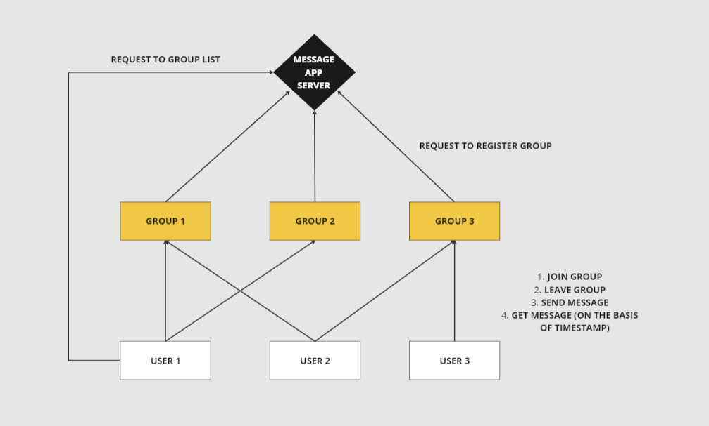

<h1> CSE530: Distributed Systems: Concepts & Design </h1>
<h2><center> Programming Assignment 1: README </center></h2>

<!-- Question 1-->
## Question 1


<!-- Question 2-->
## Question 2
<b><u> Introduction: </u></b><br>
This assignment aims to build a low-level group messaging application using ZeroMQ.
Components to the assignment:
<ul>
<li> Message Server
<li> Group Server
<li> Users
</ul>

<b><u> Architectural Overview: </u></b><br>
A central server, multiple groups, and users.


<b><u> Nodes: </u></b><br>
<ul>
<h3> Message Server: </h3>
<li> listen(): listens for incoming messages from the users.
<li> register_group(): registers a group with the group server.
<li> group_list(): returns the list of groups to the user request.
</ul>

<ul>
<h3> Group Server: </h3>
<li> register_group(): registers the group with the message server.
<li> listen_messages(): listens for incoming messages from the users.
<li> join_group(): joins the user to the group.
<li> leave_group(): leaves the user from the group.
<li> send_message(): sends the message to the group sent by the user.
<li> get_messages(): gets the messages from the group for user request based on the timestamp.
</ul>

<ul>
<h3> Users: </h3>
<li> get_group_list(): gets the list of groups from the group server.
<li> join_group(): joins the user to the group.
<li> leave_group(): leaves the user from the group.
<li> send_message(): sends the message to the group.
<li> get_messages(): gets the messages from the group for user request based on the timestamp.
</ul>

<h3> Detailed Interactions: </h3>
<ol>
<li> Message server is initialized and listens for incoming messages on port 6000. <br>
<li> Groups are initialized and listen on the provided port number. <br>
<li> Upon group initialization, the group server registers the group with the message server. <br>
<li> Users are initialized and can request the list of groups from the group server. <br>
<li> Users can join a group (or groups), leave a group, send a message to a group, and get messages from a group. <br>
</ol>


<b><u> How to run the code: </u></b><br>
1. Open the terminal and navigate to the directory where the code is present. <br>
2. Edit the "user.py" file to call functions as and how needed. <br>
3. Run the following command: <br>
```python3 message_server.py``` <br>

    Enter the details needed after running: <br> 
```python3 group_server.py``` <br>
Example: ```python script.py group2 localhost 6002``` <br>

    ```python3 user.py``` <br>
1. Note: In order to spawn multiple groups, a new terminal has to be deployed for each group and the "group_server.py" has to be run. <br> 
2. The output will be displayed on the terminal containing appropriate print statements. <br>

<b><u> Test cases: </u></b>
- 1 Message Server, 1 Group, 1 User (works)
- 1 Message Server, 1 Group, 2 Users (works)
- 1 Message Server, 2 Groups, 2 Users (works)
  - Both present on both groups


<!-- Question 3-->
## Question 3